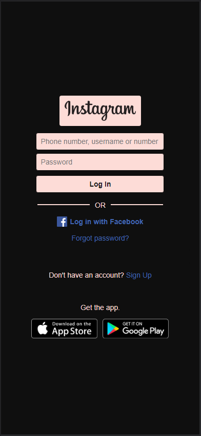

[Impulso]: https://impulso.work/
[Digital Innovation One]: https://www.dio.me/en

# Recreating Instagram login page

  </img>
  </img>

## About
This repository is a project challenge that aims the practice of **CSS**, mainly the positioning of elements using **flex containers**.

The main **CSS** styling properties practiced were:
- `display: flex` : render element as a **flex container**
- `justify-content: POSITIONING` : render the content according to the **POSITIONING** and in the direction of the defined main axis
- `align-items: POSITIONING` : render children elements according to the **POSITIONING** and in the direction of the non-main axis of the current elemet
- `flex-direction : AXIS` : change the main axis of the **flex container** to **AXIS**

## Why
This repository is a challenge of the **JavaScript Evolution** bootcamp offered by **[Impulso]** and **[Digital Innovation One]**.
